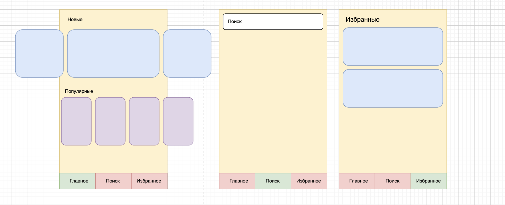

# KinoAlem
##### KinoAlem will be a sample application that uses some movie API

### Tech Stacks
- Kotlin
- Kotlin Flow
- Coroutines
- Multi module
- Architecture
    - Clean architecture
    - Single activity pattern
    - MVVM(presentation layer)
- Android Architecture Components
    - ViewModel
    - Room
- Cicerone for navigation
- Retrofit + OkHttp + Gson
- Dagger2 for DI
- View Binding
